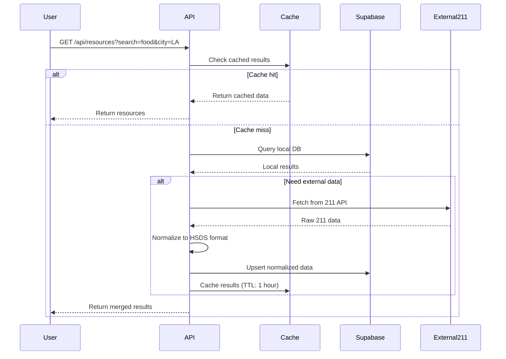

# Technical Specification: 211 API Integration

## 1. Executive Summary

This document outlines the technical approach for integrating 211 service data into the MoveFwd platform. The integration will enable users to access real-time human services information from regional 211 providers while maintaining compatibility with the HSDS (Human Services Data Specification) standard.

### Goals
- Enable users to search and discover human services from 211 databases
- Maintain data quality through verification and caching
- Support multiple 211 data sources with a unified API
- Extend the current schema to support HSDS compliance

---

## 2. Data Sources

### 2.1 Primary Sources

| Source | Type | Priority | Auth Required | Coverage |
|--------|------|----------|---------------|----------|
| **NYC 311 API** | Public | P0 | API Key | New York City |
| **Chicago 311 API** | Public | P0 | API Key | Chicago |
| **Community Services Locator** | Federal | P1 | None | National |
| **211 LA** (future) | Partnership | P2 | API Key | Los Angeles |
| **211 Bay Area** (future) | Partnership | P2 | OAuth 2.0 | Bay Area |

### 2.2 Source Comparison

```
┌─────────────────────────────────────────────────────────────────┐
│                    DATA SOURCE STRATEGY                         │
├─────────────────────────────────────────────────────────────────┤
│                                                                  │
│  Phase 1: Open APIs (No Partnership Required)                   │
│  ┌──────────────┐  ┌──────────────┐  ┌──────────────┐           │
│  │   NYC 311   │  │ Chicago 311  │  │  Gov APIs    │           │
│  └──────┬───────┘  └──────┬───────┘  └──────┬───────┘           │
│         │                 │                 │                    │
│         └────────────┬────┴────────────────┘                    │
│                      ▼                                           │
│              ┌───────────────┐                                  │
│              │  Normalization│                                  │
│              │    Layer      │                                  │
│              └───────┬───────┘                                  │
│                      ▼                                           │
│  Phase 2: Partnership APIs (Requires MOU)                       │
│  ┌──────────────┐  ┌──────────────┐                             │
│  │   211 LA     │  │211 Bay Area  │                             │
│  └──────────────┘  └──────────────┘                             │
│                                                                  │
└─────────────────────────────────────────────────────────────────┘
```

---

## 3. Schema Extensions

### 3.1 Current Schema (Existing)

```sql
-- Existing resources table (simplified)
CREATE TABLE resources (
  id UUID PRIMARY KEY DEFAULT gen_random_uuid(),
  name TEXT NOT NULL,
  description TEXT,
  categories TEXT[],
  eligibility TEXT,
  address TEXT,
  city TEXT,
  state TEXT DEFAULT 'CA',
  zip TEXT,
  latitude DECIMAL(10, 8),
  longitude DECIMAL(11, 8),
  phone TEXT,
  website TEXT,
  application_guide TEXT,
  verified BOOLEAN DEFAULT FALSE,
  source TEXT,           -- NEW: data source identifier
  source_id TEXT,        -- NEW: original ID from source
  created_at TIMESTAMPTZ,
  updated_at TIMESTAMPTZ
);
```

### 3.2 Extended Schema (HSDS Compliance)

```sql
-- Extended resources table with HSDS fields
ALTER TABLE resources ADD COLUMN IF NOT EXISTS source TEXT;
ALTER TABLE resources ADD COLUMN IF NOT EXISTS source_id TEXT;
ALTER TABLE resources ADD COLUMN IF NOT EXISTS organization_name TEXT;
ALTER TABLE resources ADD COLUMN IF NOT EXISTS organization_id TEXT;
ALTER TABLE resources ADD COLUMN IF NOT EXISTS email TEXT;
ALTER TABLE resources ADD COLUMN IF NOT EXISTS languages TEXT[];
ALTER TABLE resources ADD COLUMN IF NOT EXISTS interpretation_services TEXT[];
ALTER TABLE resources ADD COLUMN IF NOT EXISTS accessibility TEXT[];
ALTER TABLE resources ADD COLUMN IF NOT EXISTS fees TEXT;
ALTER TABLE resources ADD COLUMN IF NOT EXISTS schedule TEXT;
ALTER TABLE resources ADD COLUMN IF NOT EXISTS service_area TEXT;
ALTER TABLE resources ADD COLUMN IF NOT EXISTS last_verified_at TIMESTAMPTZ;
ALTER TABLE resources ADD COLUMN IF NOT EXISTS data_source_url TEXT;

-- New: phones table for multiple contact numbers
CREATE TABLE IF NOT EXISTS resource_phones (
  id UUID PRIMARY KEY DEFAULT gen_random_uuid(),
  resource_id UUID REFERENCES resources(id) ON DELETE CASCADE,
  phone_number TEXT NOT NULL,
  phone_type TEXT DEFAULT 'voice' CHECK (phone_type IN ('voice', 'fax', 'tty', 'sms')),
  description TEXT,
  is_primary BOOLEAN DEFAULT FALSE,
  created_at TIMESTAMPTZ DEFAULT NOW()
);

-- New: eligibility criteria table
CREATE TABLE IF NOT EXISTS resource_eligibility (
  id UUID PRIMARY KEY DEFAULT gen_random_uuid(),
  resource_id UUID REFERENCES resources(id) ON DELETE CASCADE,
  eligibility_type TEXT,
  eligibility_value TEXT,
  min_age INTEGER,
  max_age INTEGER,
  description TEXT,
  created_at TIMESTAMPTZ DEFAULT NOW()
);

-- Indexes for new fields
CREATE INDEX IF NOT EXISTS idx_resources_source ON resources(source);
CREATE INDEX IF NOT EXISTS idx_resource_phones_resource ON resource_phones(resource_id);
CREATE INDEX IF NOT EXISTS idx_resource_eligibility_resource ON resource_eligibility(resource_id);
```

### 3.3 TypeScript Types

```typescript
// Extended resource type
interface Resource {
  id: string
  name: string
  description: string | null
  categories: Category[]
  eligibility: string | null
  address: string | null
  city: string | null
  state: string
  zip: string | null
  latitude: number | null
  longitude: number | null
  phone: string | null
  website: string | null
  application_guide: string | null
  verified: boolean
  // NEW: HSDS fields
  source: string | null
  source_id: string | null
  organization_name: string | null
  organization_id: string | null
  email: string | null
  languages: string[] | null
  interpretation_services: string[] | null
  accessibility: string[] | null
  fees: string | null
  schedule: string | null
  service_area: string | null
  last_verified_at: string | null
  data_source_url: string | null
  created_at: string
  updated_at: string
}

interface ResourcePhone {
  id: string
  resource_id: string
  phone_number: string
  phone_type: 'voice' | 'fax' | 'tty' | 'sms'
  description: string | null
  is_primary: boolean
}

interface ResourceEligibility {
  id: string
  resource_id: string
  eligibility_type: string
  eligibility_value: string
  min_age: number | null
  max_age: number | null
  description: string | null
}
```

---

## 4. API Integration

### 4.1 Architecture

```
┌─────────────────────────────────────────────────────────────────┐
│                      CLIENT (Next.js)                           │
│  ┌─────────────────────────────────────────────────────────┐   │
│  │  SearchBar Component                                    │   │
│  │  - Category filter                                       │   │
│  │  - Location filter (city, zip)                          │   │
│  │  - Search input                                          │   │
│  └─────────────────────────────────────────────────────────┘   │
└──────────────────────────┬──────────────────────────────────────┘
                           │
                           ▼
┌─────────────────────────────────────────────────────────────────┐
│                    API Layer (/api/resources)                   │
│  ┌─────────────────────────────────────────────────────────┐   │
│  │  GET /api/resources                                      │   │
│  │  Query params: categories, search, city, zip, source    │   │
│  └─────────────────────────────────────────────────────────┘   │
└──────────────────────────┬──────────────────────────────────────┘
                           │
         ┌─────────────────┼─────────────────┐
         ▼                 ▼                 ▼
┌─────────────────┐ ┌─────────────┐ ┌─────────────────┐
│  Supabase DB    │ │  211 APIs   │ │  External APIs  │
│  (Primary)      │ │  (Live)     │ │  (NYC 311, etc) │
└─────────────────┘ └─────────────┘ └─────────────────┘
```

### 4.2 Data Flow



### 4.3 API Endpoints

#### GET /api/resources
Query resources from all available sources.

```typescript
// Request
GET /api/resources?{
  categories?: string,        // comma-separated: "food,housing"
  search?: string,            // search term
  city?: string,
  zip?: string,
  source?: string,            // "local", "nyc311", "chicago311", "211la"
  verified?: boolean,
  limit?: number,
  offset?: number
}

// Response
{
  data: Resource[],
  count: number,
  sources: string[]  // which sources were queried
}
```

#### GET /api/sync/211
Trigger manual sync from 211 APIs (admin only).

```typescript
// Request
GET /api/sync/211?source=nyc311

// Response
{
  success: true,
  imported: 150,
  updated: 25,
  errors: [],
  timestamp: "2024-01-15T10:30:00Z"
}
```

---

## 5. Authentication & Rate Limits

### 5.1 External API Configuration

```typescript
// lib/config.ts
export const apiConfig = {
  nyc311: {
    baseUrl: 'https://api.nyc.gov/311/srv',
    apiKey: process.env.NYC311_API_KEY,
    rateLimit: {
      requestsPerDay: 10000,
      requestsPerMinute: 100
    }
  },
  chicago311: {
    baseUrl: 'https://api.chicago.gov/311',
    apiKey: process.env.CHICAGO311_API_KEY,
    rateLimit: {
      requestsPerDay: 5000,
      requestsPerMinute: 50
    }
  },
  // Future: Partnership APIs
 211la: {
    baseUrl: 'https://api.211la.org/v1',
    apiKey: process.env.API211_LA_KEY,
    rateLimit: {
      requestsPerDay: 2000,
      requestsPerMinute: 20
    }
  }
};
```

### 5.2 Environment Variables

```bash
# .env.local

# External API Keys
NYC311_API_KEY=your_nyc311_key
CHICAGO311_API_KEY=your_chicago311_key

# Future partnership APIs
API211_LA_KEY=your_211la_key
API211_BAY_AREA_KEY=your_211ba_key

# Integration settings
SYNC_INTERVAL_HOURS=24
CACHE_TTL_SECONDS=3600
MAX_IMPORT_BATCH_SIZE=500
```

---

## 6. Data Normalization

### 6.1 HSDS Mapping

| Source Field | HSDS Field | Transform |
|--------------|-------------|-----------|
| `service.name` | `name` | Direct |
| `service.description` | `description` | Direct |
| `location.physical_address` | `address` | Compose address lines |
| `location.latitude/longitude` | `latitude/longitude` | Direct |
| `phone.number` | `phone` | Format to E.164 |
| `service.eligibility` | `eligibility` | Direct |
| `service.languages` | `languages` | Array |
| `service.interpretation_services` | `interpretation_services` | Array |
| `location.accessibility` | `accessibility` | Array |
| `service.fees` | `fees` | Direct |

### 6.2 Normalization Service

```typescript
// lib/normalize.ts
import type { Resource, ResourcePhone, ResourceEligibility } from '@/types/resources'

interface Raw211Service {
  service_name: string
  service_description: string
  address: string
  city: string
  state: string
  zip: string
  latitude: number
  longitude: number
  phone: string
  website: string
  eligibility: string
  languages: string[]
}

export function normalizeNYC311Service(raw: Raw211Service): Partial<Resource> {
  return {
    name: raw.service_name,
    description: raw.service_description,
    address: raw.address,
    city: raw.city,
    state: raw.state,
    zip: raw.zip,
    latitude: raw.latitude,
    longitude: raw.longitude,
    phone: normalizePhone(raw.phone),
    website: raw.website,
    eligibility: raw.eligibility,
    languages: raw.languages,
    source: 'nyc311',
    source_id: generateSourceId(raw),
    verified: true, // NYC 311 is authoritative
    last_verified_at: new Date().toISOString()
  }
}

function normalizePhone(phone: string): string {
  // Strip non-numeric characters, format as E.164
  const digits = phone.replace(/\D/g, '')
  if (digits.length === 10) {
    return `+1${digits}`
  }
  return phone
}
```

---

## 7. Caching Strategy

### 7.1 Cache Configuration

```typescript
// Cache keys and TTLs
export const cacheConfig = {
  resources: {
    key: 'resources',
    ttlSeconds: 3600, // 1 hour
    maxStaleSeconds: 86400 // 24 hours
  },
  sourceStatus: {
    key: 'source_status',
    ttlSeconds: 300 // 5 minutes
  },
  syncStatus: {
    key: 'sync_status',
    ttlSeconds: 60 // 1 minute
  }
}
```

### 7.2 Implementation

```typescript
// lib/cache.ts
import { createClient } from '@supabase/supabase-js'

// In-memory cache for API responses
const memoryCache = new Map<string, { data: any; expiry: number }>()

export async function getCachedOrFetch<T>(
  key: string,
  fetchFn: () => Promise<T>,
  ttlSeconds: number
): Promise<T> {
  const cached = memoryCache.get(key)
  
  if (cached && cached.expiry > Date.now()) {
    return cached.data as T
  }
  
  const data = await fetchFn()
  
  memoryCache.set(key, {
    data,
    expiry: Date.now() + ttlSeconds * 1000
  })
  
  return data
}

export function invalidateCache(pattern: string): void {
  for (const key of memoryCache.keys()) {
    if (key.includes(pattern)) {
      memoryCache.delete(key)
    }
  }
}
```

---

## 8. Implementation Plan

### 8.1 Phase 1: Foundation (Week 1-2)

- [ ] Extend database schema with HSDS fields
- [ ] Update TypeScript types
- [ ] Set up API key configuration
- [ ] Implement basic caching layer

### 8.2 Phase 2: NYC 311 Integration (Week 3-4)

- [ ] Register for NYC 311 API key
- [ ] Create NYC 311 client/connector
- [ ] Implement data normalization
- [ ] Build sync pipeline (import to DB)
- [ ] Add source to search results

### 8.3 Phase 3: Chicago 311 Integration (Week 5-6)

- [ ] Register for Chicago 311 API key
- [ ] Create Chicago 311 client
- [ ] Implement normalization
- [ ] Build sync pipeline
- [ ] Add source to search results

### 8.4 Phase 4: Advanced Features (Week 7-8)

- [ ] Implement multi-source search
- [ ] Add source attribution in UI
- [ ] Build admin sync dashboard
- [ ] Add data quality monitoring

### 8.5 Phase 5: Partnership APIs (Future)

- [ ] Initiate 211 LA partnership
- [ ] Implement OAuth 2.0 flow
- [ ] Build real-time sync (webhooks)

---

## 9. Error Handling

### 9.1 Error Types

```typescript
enum SyncErrorType {
  RATE_LIMIT_EXCEEDED = 'RATE_LIMIT_EXCEEDED',
  AUTHENTICATION_FAILED = 'AUTHENTICATION_FAILED',
  DATA_VALIDATION_FAILED = 'DATA_VALIDATION_FAILED',
  NETWORK_ERROR = 'NETWORK_ERROR',
  SOURCE_UNAVAILABLE = 'SOURCE_UNAVAILABLE'
}

interface SyncError {
  type: SyncErrorType
  source: string
  message: string
  retryable: boolean
  timestamp: string
}
```

### 9.2 Retry Strategy

```typescript
async function fetchWithRetry<T>(
  fetchFn: () => Promise<T>,
  maxRetries: number = 3,
  baseDelayMs: number = 1000
): Promise<T> {
  let lastError: Error
  
  for (let attempt = 1; attempt <= maxRetries; attempt++) {
    try {
      return await fetchFn()
    } catch (error) {
      lastError = error as Error
      
      if (!isRetryable(error)) {
        throw error
      }
      
      const delay = baseDelayMs * Math.pow(2, attempt - 1)
      await sleep(delay)
    }
  }
  
  throw lastError!
}
```

---

## 10. Monitoring & Observability

### 10.1 Metrics to Track

| Metric | Description | Alert Threshold |
|--------|-------------|-----------------|
| `sync.duration` | Time to sync from source | > 30 minutes |
| `sync.records_imported` | Records imported per sync | < 10 (vs expected) |
| `api.rate_limit_remaining` | Remaining API calls | < 100 |
| `cache.hit_rate` | Cache effectiveness | < 60% |
| `source.errors` | Errors per source | > 5% of requests |

### 10.2 Logging

```typescript
// Structured logging for sync operations
function logSyncOperation(op: 'start' | 'complete' | 'error', data: {
  source: string
  recordsProcessed?: number
  duration?: number
  error?: Error
}) {
  console.log(JSON.stringify({
    type: 'sync',
    operation: op,
    timestamp: new Date().toISOString(),
    ...data
  }))
}
```

---

## 11. UI Integration

### 11.1 Source Attribution

Display data source in resource cards:

```tsx
<ResourceCard
  resource={resource}
  badge={
    resource.source === 'nyc311' && (
      <Badge variant="outline" colorScheme="blue">
        NYC 311
      </Badge>
    )
  }
  lastVerified={resource.last_verified_at}
/>
```

### 11.2 Filter by Source

Add source filter to search UI:

```tsx
<Select
  label="Data Source"
  options={[
    { value: 'all', label: 'All Sources' },
    { value: 'local', label: 'MoveFwd Community' },
    { value: 'nyc311', label: 'NYC 311' },
    { value: 'chicago311', label: 'Chicago 311' }
  ]}
/>
```

---

## 12. Appendix

### A. Sample API Responses

#### NYC 311 Service Request

```json
{
  "service_request_id": "12345678",
  "service_name": "Food Assistance",
  "service_description": "Emergency food assistance for residents",
  "status": "active",
  "requested_datetime": "2024-01-10T10:00:00Z",
  "updated_datetime": "2024-01-15T14:30:00Z",
  "address": "123 Main St",
  "city": "New York",
  "state": "NY",
  "zip": "10001",
  "latitude": 40.7128,
  longitude": -74.0060,
  "phone": "212-555-1234"
}
```

#### Normalized HSDS Format

```json
{
  "id": "srv-12345678",
  "name": "Food Assistance",
  "description": "Emergency food assistance for residents",
  "address": "123 Main St",
  "city": "New York",
  "state": "NY",
  "zip": "10001",
  "latitude": 40.7128,
  "longitude": -74.0060,
  "phone": "+12125551234",
  "source": "nyc311",
  "source_id": "12345678",
  "verified": true,
  "last_verified_at": "2024-01-15T14:30:00Z"
}
```

### B. API Registration Links

| Source | Registration URL |
|--------|------------------|
| NYC 311 | https://portal.311.t innovation.nyc.gov/ |
| Chicago 311 | https://devportal.chicago.gov/ |
| 211 LA | Contact: api@211la.org |

### C. References

- [HSDS Specification](https://handbook.openreferral.org/en/latest/)
- [Open Referral Initiative](https://openreferral.org/)
- [NYC 311 API Docs](https://devportal.chicago.gov/)
- [Chicago 311 API Docs](https://devportal.chicago.gov/)
